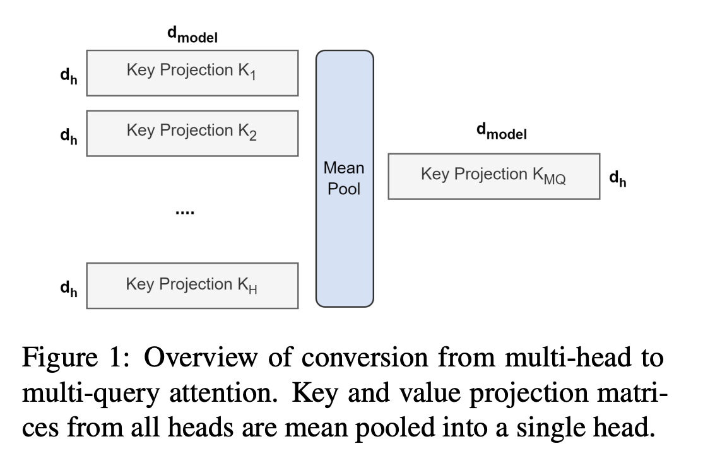
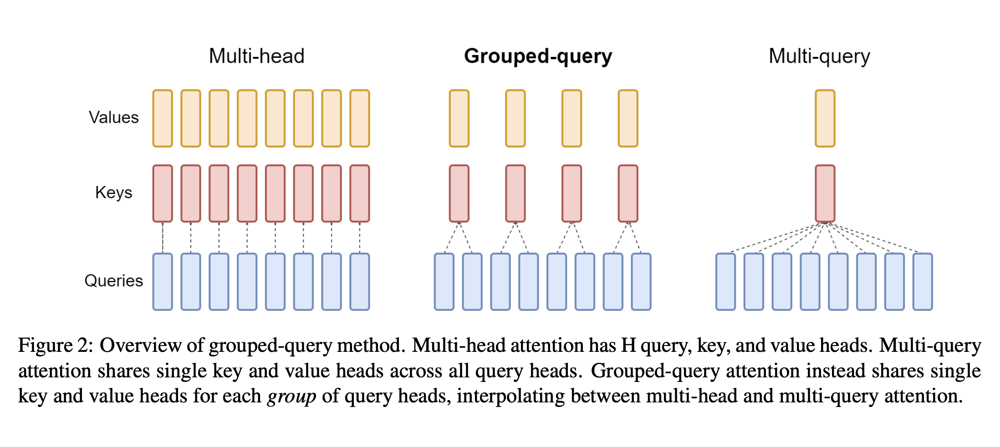
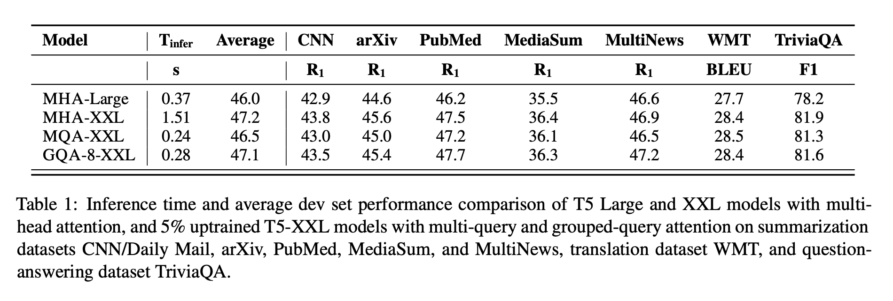

# GQA: Training Generalized Multi-Query Transformer Models from Multi-Head Checkpoints
## Abstract

한 개의 key-value head를 가지는 MQA(Multi Query Attention)은 decoder의 속도를 비약적으로 향상시켰다. 그러나 성능 하락과 더 빠른 inference 속도를 위해서만 별도의 모델을 학습시키는 것은 바람직하지 않을 수도 있다. 따라서 저자들은 (1) Multi-Head model checkpoint를 가지고 원본 모델 학습에 사용된 비용의 5%를 사용해 uptraining하는 방식과 (2) multi-query attention의 일반화 버전(key-value head의 수가 1보다 크고 query head 수보다 적은)인 GQA(Generalized Multi-Query Attention)을 제안한다. 

저자들은 GQA가 MHA(Multi-Head Attention)과 비슷한 성능에 MQA(Multi-Query Attention)과 비슷한 속도를 보인다고 설명한다.

## 1. Introduction

Autoregressive decoder inference는 decoder weight들을 불러오는 것과 매 decoding step마다 attention을 연산하는 것에서 발생하는 memory bandwidth overhead라는 극심한 bottleneck(장애물)이 있다. 이러한 memory bandwidth overhead는 MQA를 통해 매우 줄일 수 있다: MQA는 query head는 여러개를 사용하지만 key-value head는 한 개를 사용하는 attention 방법이다. 

그러나 Abstract에서 약간 언급했듯 MQA는 성능하락과 학습 불안정을 일으킨다. 또한 성능과 추론 속도를 보장하는 다른 모델을 새로 학습시킨다는 것은 불가능에 가까울 수 있다. 게다가 몇몇 모델은 이미 MQA를 적용하기도 했으나(PARM) 대다수의 모델은 적용을 하지 않았다(T5, LLAMA … etc).

이 논문은 large language model의 빠른 추론을 위한 두 가지 기여를 포함한다. 

1. 첫 번째로 Multi-Head attention을 가진 모델 checkpoint는 원본 모델 학습에 사용된 비용의 소량만 사용해 MQA model로 uptrain 될 수 있다. 이는 Multi-Query와 높은 성능이 MHA checkpoint를 얻을 수 있는 비용 효과적인 방법을 제시한다.
2. 두 번째로 MHA와 MQA의 interpolation인 GQA를 소개한다: query head의 서브그룹에 대해 한 개의 key-value head를 가진다.

Uptrain된 GQA는 MHA와 비슷한 성능을 보이며 또한 MQA과 비슷한 속도를 보여주었다.

## 2. Method

### 2.1 Uptraining

Multi-Query Attention모델로 Uptraining하기 위해서는 두 가지 작업을 거쳐야 한다.

첫 번째, checkpoint를 개조한다. Figure 1에서 checkpoint 개조 방법을 확인할 수 있다. 기존의(Multi-Head Attention에서의) Projection matrix들을 MQA의 Projection으로 변환할 때 Mean Pool 방법을 사용한다. 이 방법을 채택한 이유는 Projection matrix들에서 하나를 고르는 방법이나 랜덤으로 초기화하는 방법보다 더 높은 성능을 보여주었기 때문이다. 

두 번째로 앞서 개조한 checkpoint를 기존 모델의 pre-training 방법과 동일한 방법으로 원본 학습 step의 소량 비율의 step으로 다시 학습시킨다(pre-train).

### 2.2 Grouped-query attention

Grouped-query attention은 query attention head를 G개의 그룹으로 나누고 그룹마다 한 개의 key-value head를 공유해 사용한다. GQA_G는 G개의 query head 그룹을 가지는 GQA 모델을 나타낸다. 

중요한 점은 Introduction에서 언급된 GQA는 MHA와 MQA의 interpolation이라는 점이다. 즉, GQA_1은 한 개의 query head subgroup을 가지기 때문에 모든 Query Head가 한 개의 key-value head를 공유한다(MQA와 동일하다). 또한 GQA_H의 경우 H개의 query head subgroup을 보유한다. 각 query head는 한 개의 key-value head를 가지므로 (H개의 key-value head를 가짐) MHA와 동일하다. 

위의 Figure 2에서 각 방법의 그림을 보여준다. MHA에서 MQA로 변환할 때, key-value head들은 각 한 개의 key-value head로 mean pooling된다. key-value head의 수가 줄어들음으로써 저장해야 할 key-value head cache 양 또한 줄어들고 이에따라 불어와야 할 양이 factor H만큼 줄어들게 된다. 하지만 large model들은 일반적으로 head의 수를 늘리고 MQA를 적용했을 때 모델의 크기가 커짐에 따라 bandwidth와 capacity가 급격히 감소한다. GQA는 model의 규모가 커지더라도 동일한 비율로 bandwidth와 capacity가 줄어들게 한다.

## 3. Experiments

### 3.1 Experimental setup

> Configuation
> 

모든 모델들은 T5 아키텍처를 기반으로 한다. 주된 실험은 multi-head attention T5의 Large, XXL 모델을 multi-query, grouped query attention으로 uptrain된 T5 XXL 모델과 고려한다. MQA와 GQA는 decoder의 self-attention, cross-attention에 적용되고 encoder의 self-attention에는 적용하지 않는다.

> Uptraining
> 

Uptrained 모델들은 공개 T5으로 초기화된다. Key, value head들은 MQA, GQA 아키텍처에 맞춰 mean-pool되고 원본 pre-training setup에 맞춰 원본 pre-train step의 $\alpha$ 비율로 pre-train된다.

> Data
> 

평가를 위해 세 가지의 task를 사용했다: 1) summarization task, 2) translation task 3) queation answering. 각 task에 사용된 데이터셋들은 아래와 같다.

1. Summarization task : CNN/Daily Mail (Nallapati et al., 2016), arXiv, PubMed (Cohan et al., 2018), MediaSum (Zhu et al., 2021), Multi-News
2. translation task :  WMT 2014 English-to-German
3. question answering : TriviaQA (Joshi et al., 2017)

GLUE와 같은 유명한 autoregressive inference classification benchmark들은 적용하기가 힘들기에 사용하지 않았다.

