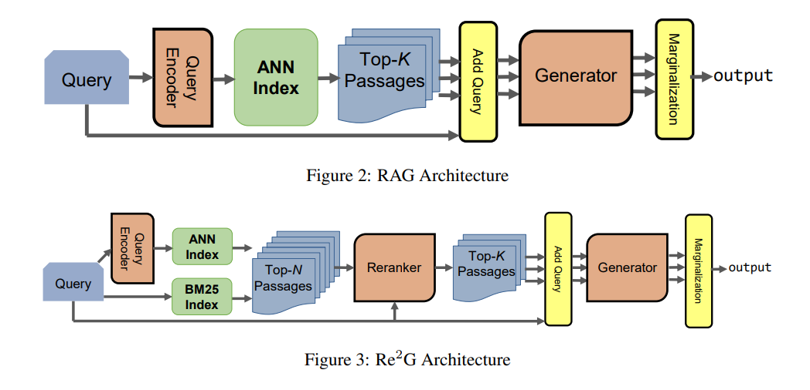
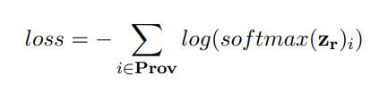
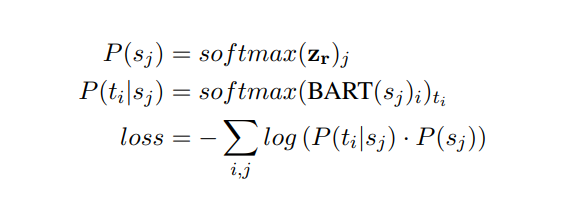
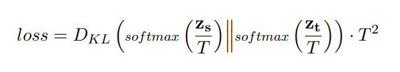

# Re2G
---

## 구조

기존 RAG와의 차이점으로 Top-N개의 passage를 뽑고(BM25추가) Reranker를 통해 다시 Top-k개로 정렬 및 추출 후 generate를 수행한다.

## 학습 순서

- 4개의 단계로 구성된다; DPR training, generation training, reranking training, full end-to-end training.
- DPR, generation 학습의 경우 KGI_0과 동일하다(코드 또한 동일하게 사용한 것 같다).

> **각 학습 별 추가 자료**
> 
1. DPR Stage 1 training
    - RAG와 동일하게 query, positive passage, hard negative passage(from BM25)를 128개 인스턴스에 batch에 입력으로 사용된다.
    - loss는 negative log likelihood가 positive에 대해 사용된다.
    - DPR Stage 1 training이 완료되면 코퍼스 내의 passage들은 faiss의 Hierarchical Navigable Small World(HNSW)를 통해 index화 된다.
2. generation training
    - generation training은 query encoder의 학습을 확장하고 BART_Large seq2seq 모델을 target sequence output에 대해 학습하는 것이다.
    - 해당 학습은 RAG와 동일하다.
3. **reranking training**
    - 격리해 학습을 수행.
    - DPR과 DM25를 통해 얻은 retrieval 결과를 합쳐(학습 셋으로 이용) 학습을 시작한다.
    - 몇몇 데이터셋들은 다중 positive passage를 가지고 있으므로 positive passage들에 대해 summed negative log likelihood를 loss함수로 사용한다.
    - reranker에서 나오는 logit은 **z_r**이며 정답 passage들의(ground truth provenance에서 주어짐) index들은 **Prov**이다.

1. **end-to-end training**
    - end-to-end 학습은 특별한 도전이다.
    - **in RAG, query encoder로 확산되는 gradient의 경우, 각 sequence로 확신되는 weight로 사용될 query-passage vector 내적 때문이다(RAG에서는 marginalization으로 부른다).**
    - Bart 모델의 input은 (s_j = p_j [SEP] q)형태의 sequence일 것이다; p_j는 retrieve된 passage.
    - 각 sequence의 확률은 retrieval(or reranker) 점수의 softmax값으로 정해진다.
    - s_j가 주어질 때 targe token t_j의 각 확률 값은 Bart의 전체 token prediction logit의 softmax값으로 정해진다.
    
    → 따라서 전체 target token, sequence의 negative log likelihood summed 값이 된다(**각 sequence의 확률 값을 weight로 제공하면서**).
    
    - Re2G는 initial retrieval 점수가 아닌 reranker의 점수를 weight로 사용해 generator가 어떤 문장에 더 impact를 주는지 정한다.
        
        →  이는 reranker가 target output, 즉 ground truth를 통해 학습하는 것을 허용하지만 이는 곧 query encoder의 gradient가 0으로 되는 것을 의미한다; 더 이상 query-passage representation vector의 내적에 의존하지 않게 되기 때문이다.
        
        
        
    
    > 위 문제를 위한 해결법
    > 
    1. DPR, reranker 점수를 합친다.
    2. query encoder를 얼린다(파라미터 업데이트를 하지 않는다).
    3. 온라인 지식 정제(online knowledge distillation)
    
    > 각 해결법 별 추가 설명
    > 
    1.  첫 번째 후보 솔루션은 치명적 결함이 있다. DPR과 reranker의 log softmax 값을 더해서 두 시스템이 generation에 미치는 영향을 통해 학습될 수 있다. 그러나 DPR 점수가 reranker 점수에 더해지게 되면, DPR 점수는 reranker의 점수를 보완하는 용도로 학습되게 된다. 
    
        이렇게 될 시, DPR은 후보 passage에 대해 점수를 줄 때 정답에 높은 점수를 주는것이 아니라 reranker가 낮은 점수를 줄 passage에 높은 점수를 주는 모델로 학습될 것이다; 실제 해당 방식으로 학습 시 DPR의 성능(또한 전체 systen의 성능)이 매우 낮아지는 것을 확인했다.
    2.  해당 방법은 가장 간단한 방법이다. 오직 reranker와 generation component들 만을 학습시키는 것이다. 또한 저자들은 Wizard of Wikipedia(논문에서 사용한 데이터셋)에서 가장 좋은 솔루션이였다고 밝혔다. 짚고 넘어가야 할 점은 현재 DPR은 2단계에 걸쳐 이미 학습을 거친 상태라는 것이다. 첫 째로 provenance를 통해 학습되었고 두 번째로 generation을 학습할 때(RAG model) 학습이 되었다. 
    3. reranker를 teacher model로, DPR을 student model로 하는 knowledge distillation을 적용한다. interaction model에서 representation model로 knowledge를 distill한다. 이는 reranker가 학습되고 있는 때 online으로 일어난다(occur). 
    
        따라서 initial retrieval의 loss는 retrieved passage에서 나오는 분포와 동일한 passage에 대한 reranker의 확률분포끼리의 KL-divergence가 된다. 과도한 loss와 안정적 학습을 위해 temperature 하이퍼파라미터 T가 분포를 부드럽게 만든다.
        
        
        
        knowledge distillation은 일반적 이점으로 positive, negative instance 신호만 제공하는 것이 아니라 negativeness의 정도까지 제공해준다. 추가적으로 저자들은 retrieve로 n=12로 DPR모델에서 passage들을 뽑아내고 이후 top-k(k=5)를 통해 generation에 사용한다.