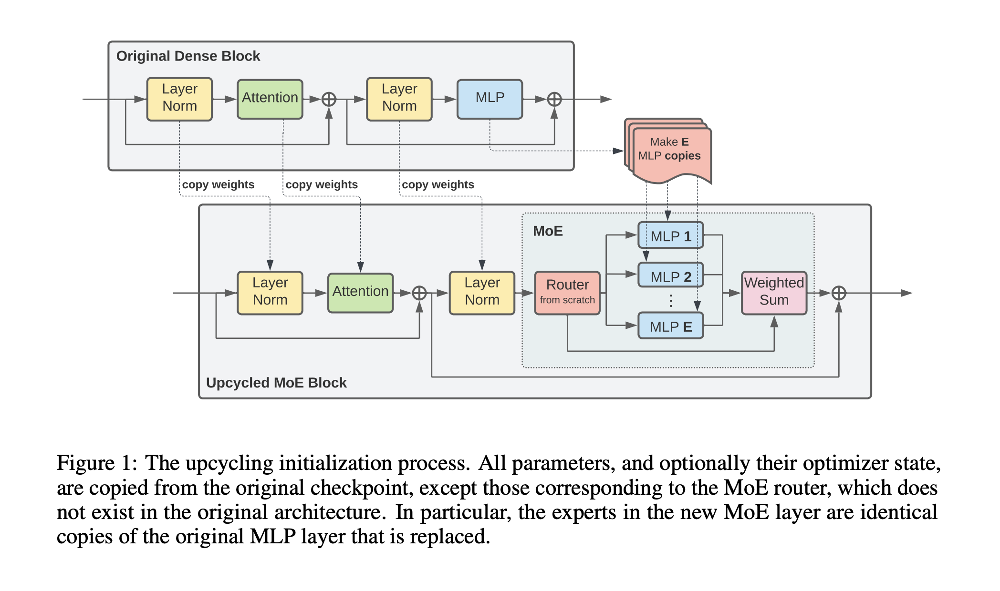
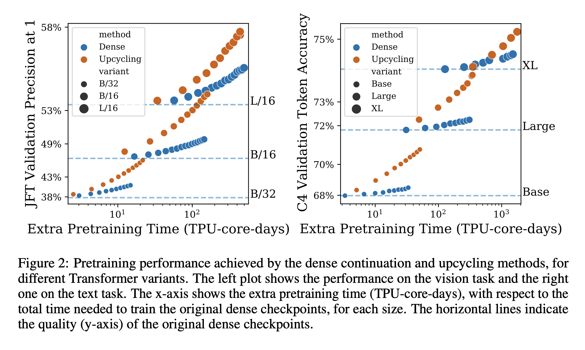

# Sparse Upcycling

## Abstract

거대한 neural network를 수렴하게끔 학습시키는 것은 대부분 매우 많은 비용이 필요하다. 이 때문에 소량의 미리 학습된 dense model 여러 task, context에 재사용된다. 모델 크기를 비용에서 제외하기 위한 노력인 increasingly, sparsely activated model은 dense model의 매력적인 대안이 되고는 있지만, 큰 모델을 0에서부터 새로 학습시킨다는 점과 데이터 부족이라는 문제를 겪고 있다. 따라서 dense checkpoint에서부터 sparsely activated Mixture-of-Experts model을 initialize함으로써 학습 비용을 재 사용할 수 있는 간단한 방법인 “sparse upcycling”을 제안한다.

## Introduction

모델의 크기를 키우는 것은 deep learning에서 성능을 향상시키는 주된 방법이다. NLP의 Bert에서 GPT3을 거쳐 PARM까지, Vision의 AlexNet에서 ViT-G까지 이러한 sota모델들은 0에서부터 학습되었다. 이는 상상이상의 비용을 초래하고 large language model의 연구는 거대한 비용을 감당할 수 있는 소수의 연구실에서만 진행할 수 있는 상황이다. 

따라서 해당 논문에서 model upcycling을 제안한다: 이 방법은 기존 모델을 비교적 적은 양의 계산 예산을 통해 upgrade시킨다. 특히 dense model을 더 크고, sparsely activated Mixture-of-Experts(MoEs)로 upcycling 하는 것에 집중한다(새로운 unique sources of data를 사용하지 않았다). 우리는 warm-start MoE 학습을 위해 사용 될 pretrained dense Transformer checkpoint가 존재한다고 가정한다. MoE layer들 로부터 오는 추가적 능력을 활용해 우리는 original model보다 더 높은 성능의 MoE model을 얻을 수 있었고 이는 original model 학습에 사용된 비용보다 적은 비용으로 학습시켰다. Language, Vision 모두에 대해 연구한 모델들에 걸쳐 40%보다 적은 추가 예산을 통한 upcycling은 original Transformer model을 계속 이어 학습시켰을 때 얻어지는 결과를 능가하는 성능을 가져온다.

Upcycling은 아래 두 가지 경우에 특히 효과적이다.

1. Transformer 모델에 접근 권한이 있고(공개된 여러 transformer models), 예산이 많지 않을 때.
2. Large transformer 모델을 학습시키는데 dense, MoE 모델 중 어느것이 더 효과적인지 알 수 없을 때(보통 후자가 더 효과적이나 dense model에 비해 구현이 더 복잡하다). 이때는 dense model을 학습시킨 후 upcycling을 통해 MoE 모델로 변환할 수 있다.

Model upcycling의 주된 challange는 모델 구조 변화에서 오는 initial 성능 하락을 극복하는 것이다. Vision, Language 모델에서 예산이 original model train보다 +10%~+60% 정도 있을 때 Upcycling이 엄청나게 효과적인 것을 확인하였다. 

예를 들자면 ViT-B/16 모델을 ImageNet 10-shot보다 1% 성능을 향상시키기 위해서는 58%의 추가 학습시간(original 학습 시간에 비함)을 필요로 한다. 그러나 Upcycling의 경우 단 13%의 추가 학습시간만 있어도 성능을 향상시킬 수 있었다.

## Background

### 1. Sparsely Activated Mixture-of-Experts(MoE)

sparse model은 오직 각 input parameter의 소량부분(subset)만 활성화시키는 방법으로 model의 크기가 커질 시 연산비용이 증가하는 문제를 완화시키는 것을 시도한다. sparsely activated MoE model은 sparse model군에 친화적인 accelerator(가속기)이다.

MoE 모델은 기존 Transformer block들을 MoE block으로 대체한다. 특히 Transformer block의 MLP들을 여러개의 학습가능한 Expert(보통 MLP)와 작은 network로 각 토큰에 어떤 expert를 적용할지를 결정하는  router로 대체한다.

여러 종류의 routing 알고리즘들이 개발되었지만, 해당 논문은 Expert Choice Routing을 채택하였다. 따라서 Expert Choice Routing 알고리즘에 집중한다. 우선 $E$와 $n$을 지정한다.

- $E$ : Expert의 총 개수
- $n$ : token들의 총 개수

router는 routing 확률을 담고있는 matrix $R \in \mathbb{R}^{n \times E}$ 를 output으로 내보내며, 이 matrix의 row $r_i \in \mathbb{R}^E$은 i번째 토큰에 대한 expert들 $E$의 분포를 의미한다($r_{ij} \geq 0$ and $\sum_j{r_{ij}} = 1$). 이렇게 되면 모든 expert $e$는 독립적으로 가장 높은 확률에 따라 T token들을 고르고(i.e., column에 대해 top-T를 적용한다) 가공한다(process them). $T$는 $T=C(n/E)$로 파라미터화(parameterize)된다. $C$는 용량계수(capacity factor)로 expert가 더 많이 혹은 더 적게 token을 처리하도록 조정한다. C가 1일 경우 각 expert들은 $n/E$개의 token들을 처리한다; 기억해야 할 점은 몇몇 token들은 여러개의 expert들에 의해 처리될 것이고 반면 다른 것들은 처리되지 않을 것이다. 이는 model parameter 증가를 적은 FLOPs overhead만을 동반하는 것으로 가능하게 해준다.

모든 parameter와 optimizer state는 원본 checkpoint에서 복사된다. 단, MoE router는 원본 구조에 포함되어 있지 않으므로 제외돤다. 특히 expert들은 치환 대상인 원본 MLP layer의 복사본이다.

### 2.2 Architectures

Language, Vision task 모두 동일한 sparse upcycling recipe를 적용한다; language는 T5(encoder-decoder)에, vision은 ViT(encoder)모델에 집중한다. 각 모델의 encoder에 동일한 gating 함수와 MoE hyperparameter를 적용했다.

> Vision
> 

Vision Transformer(ViT)는 encoder only Transformer 구조로 image들을 tokenize 및 embed한다. Upcycling을 B/32, B/16, L/32 and L/16모델들에 기반해 진행한다. MoE들의 결과는 전반적으로 Vision Transformer MoE 논문을 따르지만, 두 가지의 차이를 포함한다. 1) global average pooling을 사용했다. 2) Expert Choice Router를 사용했다.

> Language
> 

Encoder-decoder 구조인 T5를 통해 실험을 진행하였다. Base, large, XL model들을 upcycling하였으며 encoder, decoder 모두를 희소화(sparsify)하였다. Vision setting처럼 Expert Choice Router를 채택하였고 $K=2$로 Top-K routing을 decoder에 적용해 주었다.

## 3. The Upcycling Algorithm

Algorithm은 Figure 1에 표현되어있다. model을 upcycling하기 위해서는 그림에서처럼 dense model의 parameter가 요구된다. 새로운 model의 transformer block의 number, shape는 기존 dense model과 동일하다. MLP layer들의 하위집합(subset)이 MoE layer들로 확장된다. 나머지 MLP layer들은 모든 layer norm, attention layer, embedding, output layer와 함께 기존 모델에서 새로운 모델로 복사된다. 각 MoE layer는 고정된 개수의 expert를 가지고 있고 앞서 설명했던 것 처럼 expert들은 원본 MLP의 복사본이다. 추가적으로 랜덤으로 weight를 초기화한 router가 layer에 추가된다. 

새로운 모델이 불러오기 및 초기화가 된 후, 예산 및 자원에 따라 추가 step을 학습시킨다. 학습 시 원본 hyperparameter를 따른다; 원본 checkpoint과 동일한 batch size, learning rate schedule, weight decay.

### 3.1 Design Decisions

Upcycling model의 성능은 MoE layer의 구조에 따라 크게 영향을 받는다. Upcycle된 layer 수, expert의 수, expert의 capacity의 증가는 보통 model의 성능을 증가시킨다. 그러나 layer를 더 과감하게 재구성 했으므로 연산비용의 증가와 초기 품질저하가 동반된다. 

> Router Type
> 

Vision model과 language model의 encoder에 capacity factor $C=2$의 Expert Choice routing을 사용했다. Train time(full teacher forcing) 대 inference time(단일 token auto-regressive decoding)의 불일치를 피하기 위해 language model decoder에 $K=2$의 Top-K routing을 적용해 주었다.

> Number layers to upcycle
> 

MoE layer의 수를 늘리게 되면 model capacity는 급격히 올라가게 되고, 연산 비용의 증가와 원본 dense 모델에 비해 Upcycling 모델의 초기 성능이 떨어지게 된다. 4.2.2의 abalation과 MoE 문헌의 규칙을 기반으로 따로 명시되지 않는 한 MLP layer의 절반을 MoE layer로 대체한다.

> Number Of Experts To Add In Upcycled Layers
> 

각각의 expert들은 model의 capacity를 확장시킬 수 있는 학습 가능한 파라미터들을 가지고 있다. 안심할 만한 점은 expert capacity(expert가 처리하는 token의 수)는 expert의 개수와 반비례하기에 더 많은 expert들을 추가한들 FLOPS나 run time에 *상당한* 영향을 끼치지 않는다. 그러나 경험 상(저자) 매우 큰 개수의 expert를 활용할 시 baseline dense model에 비해 상당한 initial 성능 하락이 발생한다. **이 논문에서는 initial dense baseline model의 연산 비용의 +20% ~ +100%의 비용으로 upcycle하며 해당 체계 안에서 32개의 expert를 활용할 때 타협 가능한 성능을 얻어냈다.**

> Expert Capacity
> 

Expert capacity C를 튜닝함으로써 각 토큰을 평균적으로 처리하는 expert의 수를 조정할 수 있다. 큰 expert capacity는 일반적으로 높은 성능을 보여주지만 또한 FLOPS와 run time을 높이기도 한다. 그럼에도 expert capacity를 올릴 경우 step이 증가할 수록 성능을 높여준다. $C=2$일 때 연산 시간 기준으로 좋은 성능을 보여주었다. 

> Resuming optimizer state(vision only)
> 

Upcycling을 진행 할 때 원본 dense checkpoint의 optimizer state와 model paremeter를 재사용(resume)할 수 있다. **Vision model에서 optimizer state를 재사용할 시 performance boost를 제공하는 것을 발견했다**. 우리의 Language 실험에서는 해당 방식을 통한 어떠한 개선도 볼 수 없었기 때문에 vision model에 대해서만 optimizer state를 재사용 하였다.

> Normalize weights after routing(vision only)
> 

Upcycling model surgery를 적용할 때 성능 하락을 줄이기 위한 노력의 일환으로 각 토큰의 router 결합 가중치를 1로 정규화하는 방법을 시도했다. 이 방법은 각 토큰은 기존 dense model에서는 하나의 MLP expert에 의해 처리되었었다는 직관을 따른다. Router 가중치 정규화는 upcycled vision model에서는 도움을 주었지만, upcycled language model에서는 되려 성능을 하락시켰다.  이 차이에 대한 하나의 가설은 vision model은 모든 부분에서 Expert Choice routing을 사용하지만, language model은 encoder에서는 Expert Choice를, decoder에서는 Top-K routing을 사용한다는 것이다.

## 4. Experiments

해당 파트에서는 본 논문의 메인 실험 결과를 공유한다. 대부분의 결과는 quality vs. cost 그래프로 구성되어 있다.

### 4.1 Experimental Setup

다양한 크기의 모델을 Upcycling하고 성능들을 보았고 베이스라인으로는 원본 dense 모델을 이어서 학습하여주었다.

> Language experiments
> 

Language 실험의 경우 Raffel et al. (2020)[T5 논문]의 setup을 따라간다. C4 dataset의 span corruption task를 통해 pretrain을 진행했으며 finetuning은 SuperGLUE의 모든 task를 동시에 동일 비율로 섞어 진행했다. 중요한 측면은 abalation에 주로 사용되는 Base model의 경우 dense baseline checkpoint를 저자들이 직접 pretrain해 사용했다. 또한 Upcycling 알고리즘의 다양성을 강조하기 위해 Large, XL모델의 경우 공식 T5 checkpoint에서 모든 실험을 시작한다.

### 4.2 Experimental Results

### 4.2.1 Core Results

Figure 2에서는 vision, text 모델에 대한 pretraining quality vs. TPU-core-days를 나타낸 그래프이다. 점선은 각 모델(text 그래프로 예를 들자면 Base, Large, XL 모델들)의 원본 dense checkpoint의 성능이다. 어떠한 task나 모델크기가 주어져도 매우 제한된 추가 예산을 사용할 경우 dense, upcycling 모델이 비슷한 성능을 보인다. - 원본 checkpoint의 성능을 나타내는 점선과 매우 가까운 것을 볼 수 있음. **그러나 엄청난 양의 예산을 사용할 시, upcycling architecture에서 많은 성능향상을 확인할 수 있다.**